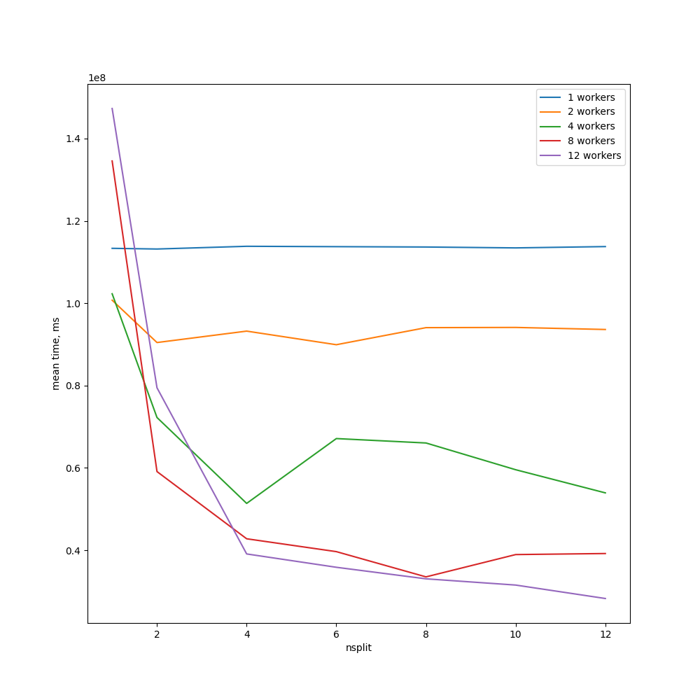
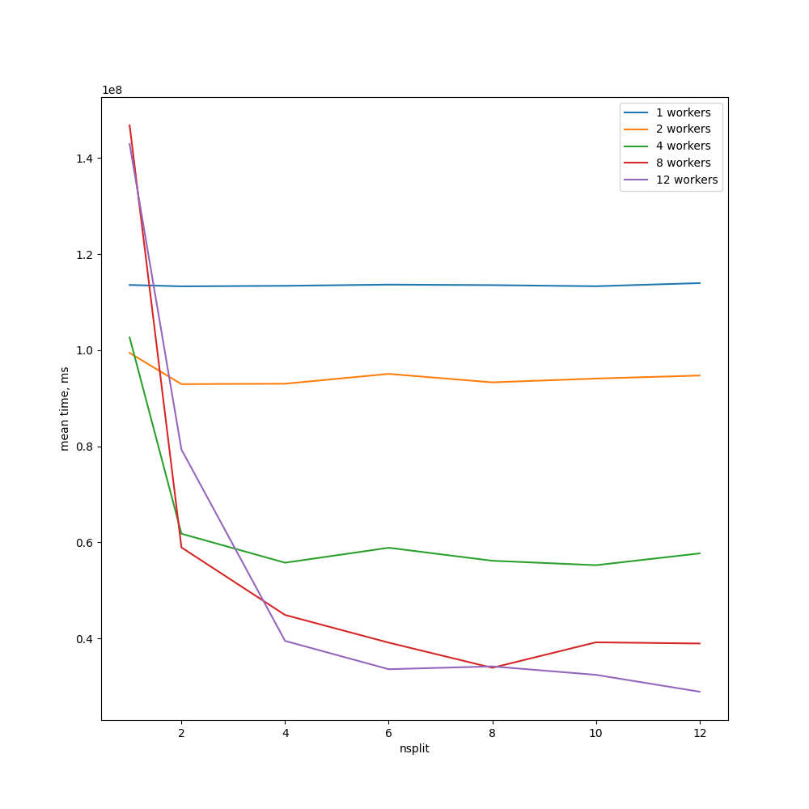
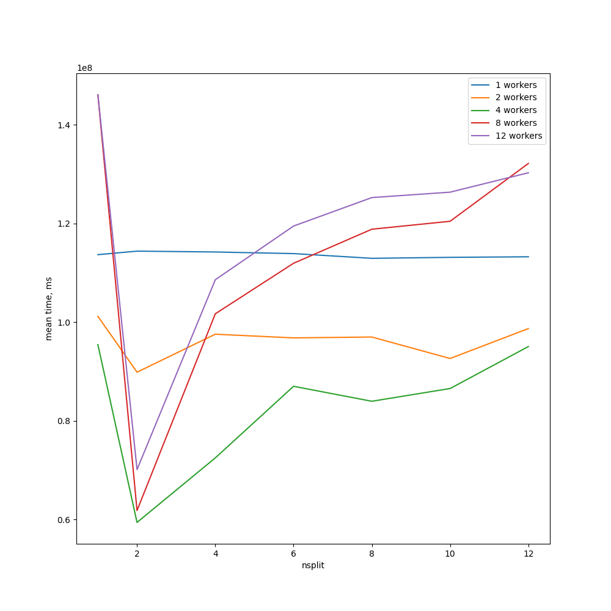
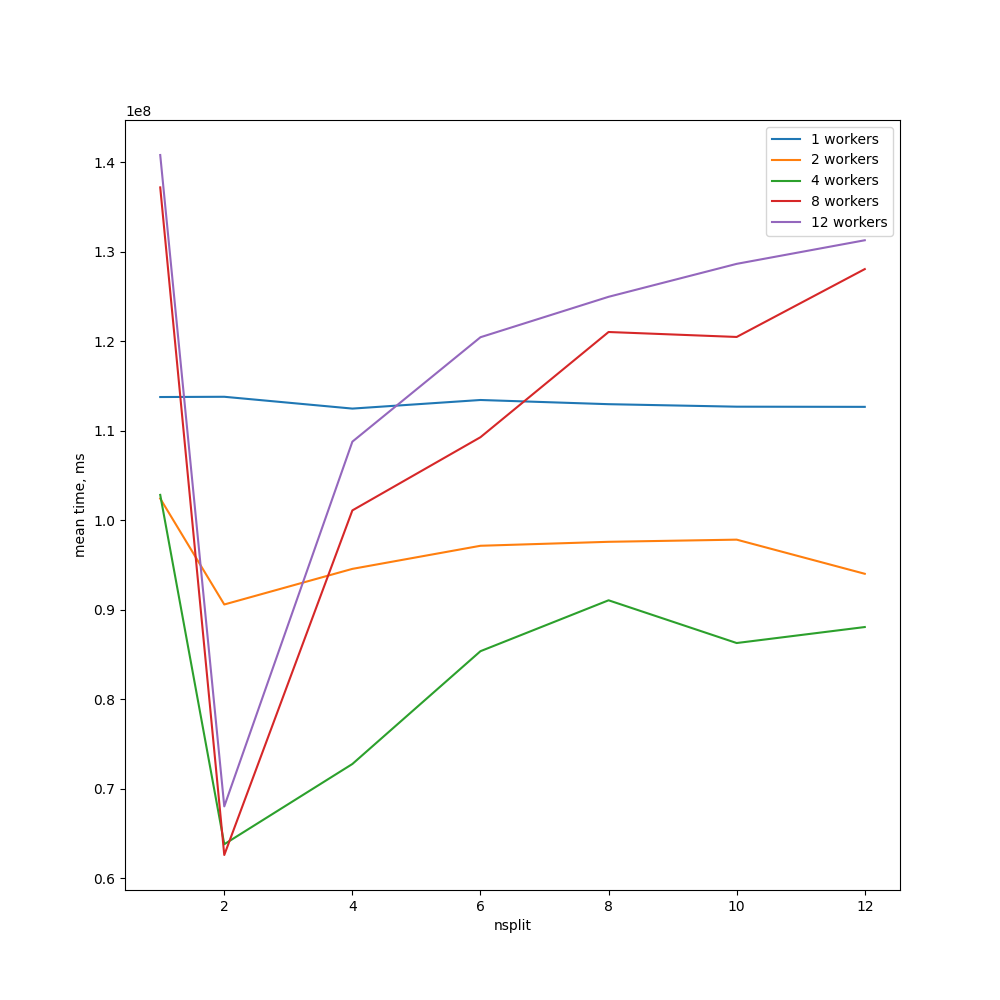
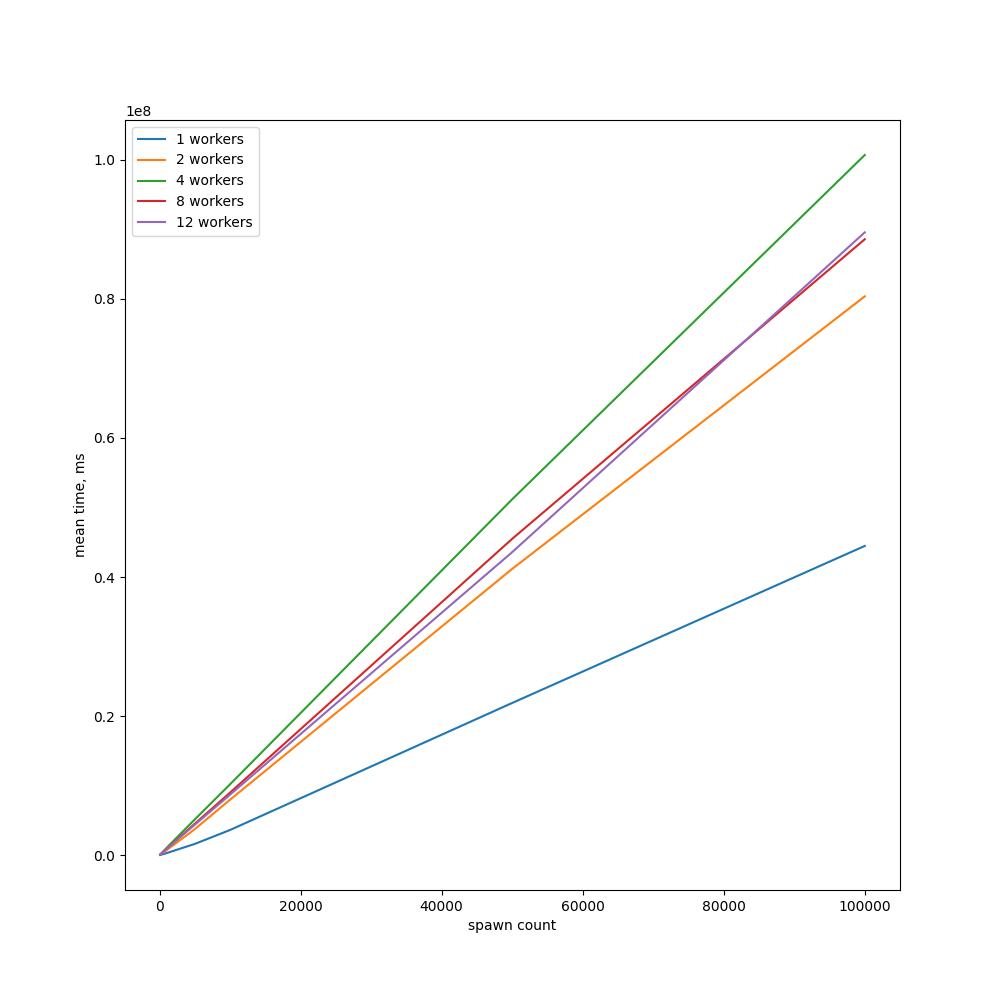

# tokiobench

The repository presents a set of custom benchmarks for tokio asynchronous runtime. А **lower** value is **better**.

# Benchmarks

## Characteristics of benchmarks

Each subsequent benchmark is an estimate of the average execution time of a fixed number of tasks using `multi_threaded` tokio runtime.

The exact current parameters can be found [here](src/params.rs).

## Workload 

This benchmark is aimed at evaluating the scenario of generating a large number of tasks from the small number of producers tasks. And it is implemented in two versions.

### Uniform workload

N_SPAWN tasks are divided approximately equally between `nsplit` actively spawning tasks.

That is, let's say for N_SPAWN = 100, where N_SPAWN is the number of spawning tasks, the partition with a factor of 4 will look like [25; 4].

You can find out more about the task split method [here](src/split.rs).

#### Uniform split with simulation of cpu bound work in each produced task

#### Uniform split with empty lambda as produced task

### Geometric progressin workload

In this case, the N_SPAWN tasks are divided so that each subsequent producer gets `nsplit` times less. That is, splitting 1000 elements with `nsplit` == 3 will be as follows: [667, 222, 74, 25, 8, 3, 1].

You can find out more about the task split method [here](src/split.rs).

#### Geometric progression in the number of spawning tasks with simulation of cpu bound work

#### Geometric progression in the number of spawning empty async lambdas

The source code can be found [here](benches/workload.rs)

## Spawner

This benchmark represents a scenario for the production of a large number of tasks from a single producer's task in two varants.

#### Spawn from `block_on` async lambda

#### Spawn from local async task

The source code can be found [here](benches/spawner.rs)

## License. 

The work was performed under an MIT license, the text of which can be found [here](LICENSE).

## Contribution

Feel free to suggest any changes and criticize the current implementation!
