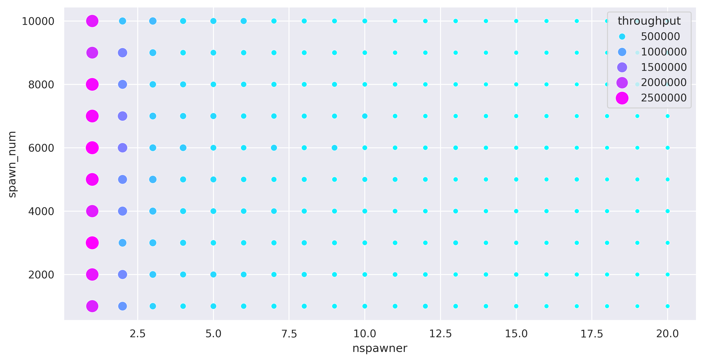

# Tatlin benchmark

The following image represents tokio's throughput on a benchmark, courtesy of Rostislav. **More** --- **better**.

# Throughput:

# Metrics

The following table shows the metrics obtained from tokio runtime during the execution of the benchmark, the throughput of which is measured above.

Nspawner | Global queue depth                    |  Total Local queue depth          |  Total steal count
:-------------------------:|:-------------------------:|:-------------------------:|:-------------------------:
1 | nw(1)/global_queue_depthlowess.png)  |  nw(1)/total_local_queue_depthlowess.png) | nw(1)/total_steal_countlowess.png)
2 | nw(2)/global_queue_depthlowess.png)  |  nw(2)/total_local_queue_depthlowess.png) | nw(2)/total_steal_countlowess.png)
3 | nw(3)/global_queue_depthlowess.png)  |  nw(3)/total_local_queue_depthlowess.png) | nw(3)/total_steal_countlowess.png)
4 | nw(4)/global_queue_depthlowess.png)  |  nw(4)/total_local_queue_depthlowess.png) | nw(4)/total_steal_countlowess.png)
5 | nw(5)/global_queue_depthlowess.png)  |  nw(5)/total_local_queue_depthlowess.png) | nw(5)/total_steal_countlowess.png)
6 | nw(6)/global_queue_depthlowess.png)  |  nw(6)/total_local_queue_depthlowess.png) | nw(6)/total_steal_countlowess.png)
7 | nw(7)/global_queue_depthlowess.png)  |  nw(7)/total_local_queue_depthlowess.png) | nw(7)/total_steal_countlowess.png)
8 | nw(8)/global_queue_depthlowess.png)  |  nw(8)/total_local_queue_depthlowess.png) | nw(8)/total_steal_countlowess.png)
9 | nw(9)/global_queue_depthlowess.png)  |  nw(9)/total_local_queue_depthlowess.png) | nw(9)/total_steal_countlowess.png)
